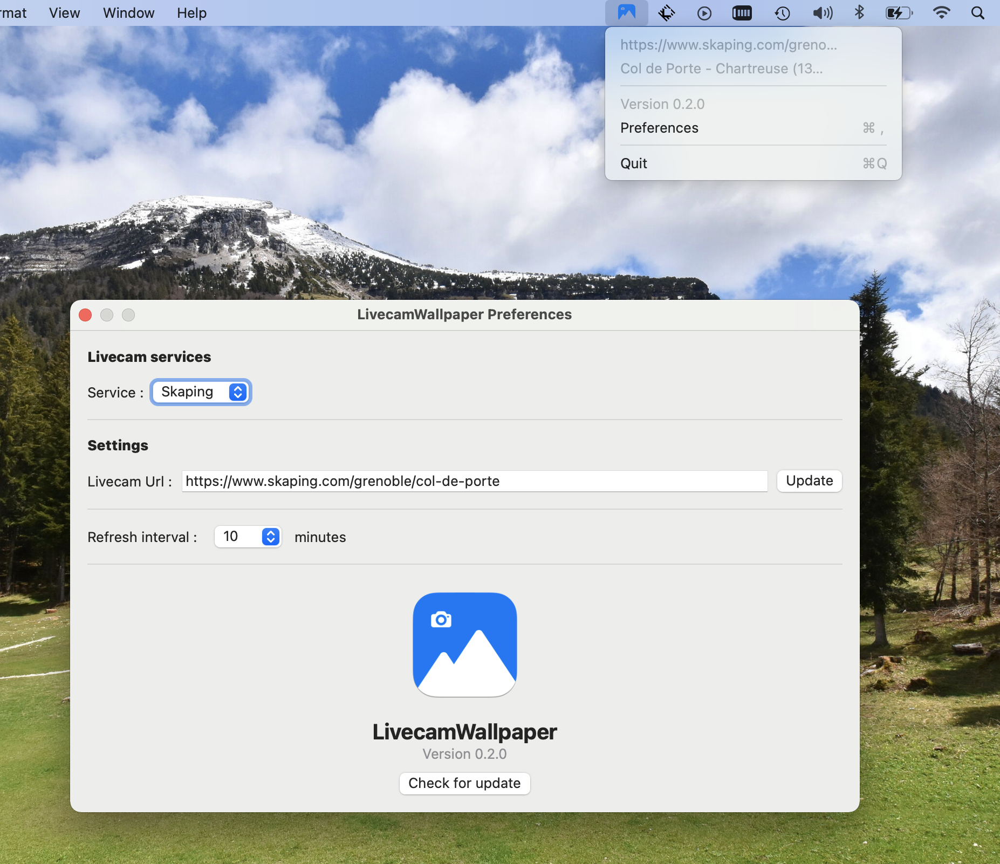

<h1>LivecamWallpaper</h1>

<b>Make any livecam as your Mac dekstop wallpaper</b>

LivecamWallpaper allows you to set live images from a livecam as a wallpaper. You can can choose the refresh interval of the wallpaper.

## Installation

You can download the latest version [here](https://github.com/pierreberger/Livecamwallpaper/releases/latest/download/LivecamWallpaper.dmg) (macOS only) 

## Livecam services

- [Skaping](https://www.skaping.com/about/references/)
- Other coming soon

## Screenshots

## Libraries

 - &nbsp;&nbsp;LivecamWallpaper is using [Bugsnag](https://www.bugsnag.com/) for error monitoring.

- [Defaults](https://github.com/sindresorhus/Defaults)

## Thanks

- [Stats](https://github.com/exelban/stats) and [Plash](https://github.com/sindresorhus/Plash) for inspiration.